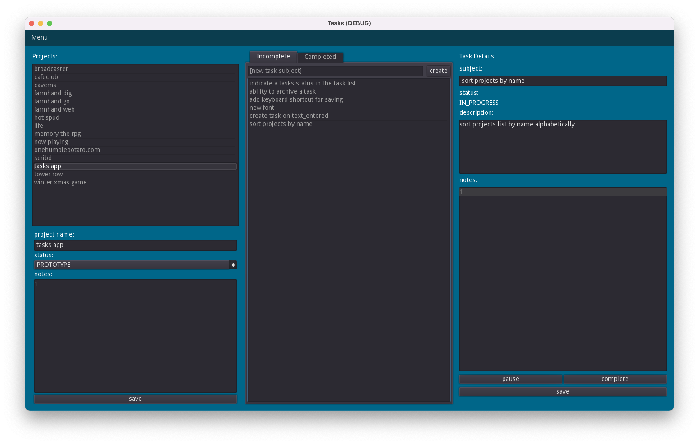

# Chalk Out

An application for managing projects and tasks.

## why use this?

At the moment, you probably shouldn't :). This app is being built for my own wants and is currently subject to random features being added, and removed at will. However, if you have lots of small projects, or you enjoy using todo lists but would like a few more features on top of that, then follow along!

## Methodology

I will be the first to admit there are already *tons* of ways to manage projects, todo lists, etc, available out there. If you already have one you love, that's awesome! This probably won't replace it, but I personally find myself going back to a good old pencil and paper list more often than not. There are some definite advantages to being digital though. So, this app is my attempt to build something that bridges the gap for myself.

This app aims to be as out of your way as possible, while giving you the ability to manage a large number of projects, with any amount of tasks in each. It also doesn't require a login, an account, or any other sort of hoops to jump through. Just open it, and get to work.

## Features

There's already a lot of capability built here, but it may not be very intuitive yet. In general there are a few manual "save" buttons in the UI, but most everything saves automatically when changes are made.

### Create a project

The top of the app has a menubar with a "Menu" that can be opened. Inside here is the option to create a new project, which will then prompt you for the project name to be created. Further metadata can be specified for the project later.

### Project metadata

Once a project exists it can be selected in the left column, and then below it there will be a spot for editing the project metadata. It's barebones right now, but the project can have a "status" (i.e. idea/prototype/development), and notes. Other stuff will probably show up here as the project evolves.

### Create a task

Select a project from the left column and then the middle area can be used to create tasks. The form for creating a task is always present here. When a task is created, it shows up in the list below the create task form.

### Edit task details

Similar to projects, tasks have lots of other info associated to them other than just the subject. They have a status, longer description, and a spot for additional notes. The rightmost column is where details can be edited when a task is selected in the middle column, but moving the task through states requires interacting with the state-context sensitive actions at the bottom of this column.

### Task status flow

When first created a task is put into the "open" state. Actions in the rightmost column allow for advancing through states in a predefined order.

- open -> in progress
- in progress -> paused, or blocked, or completed
- paused -> in progress (resume)
- blocked -> in progress
- completed -> reopen

Once a task has been completed it is moved to the "completed" tab of the middle column and out of the "incomplete" one to keep that list focused on things that need done.

### Exporting data

In the "Menu" at the top there is an option to export data that will open a file dialog prompt for choosing a place to save the exported data. Give it any name you want, and all the data will be dumped to this location. I highly recommend saving this file somewhere that is automatically backed up like Dropbox!

### Importing data

The inverse of exporting also exists in the "Menu" at the top. Import can read any file that has been exported and will reset the application with the new data. It will _not_ overwrite the default data the app uses until you do some action that saves.

If you import data you didn't actually want, just quit and reopen the app to get back to the previous set of data. However, once a save action has happened after the import, the previous data will no longer be able to be retrieved.

## Development Plan

I plan to use this in my day to day life so features will likely pop up whenever I feel I need them. Feedback is welcome if you check out this app! I can't promise it will work for everyone, but if it does help you out, I would love to hear about it!
